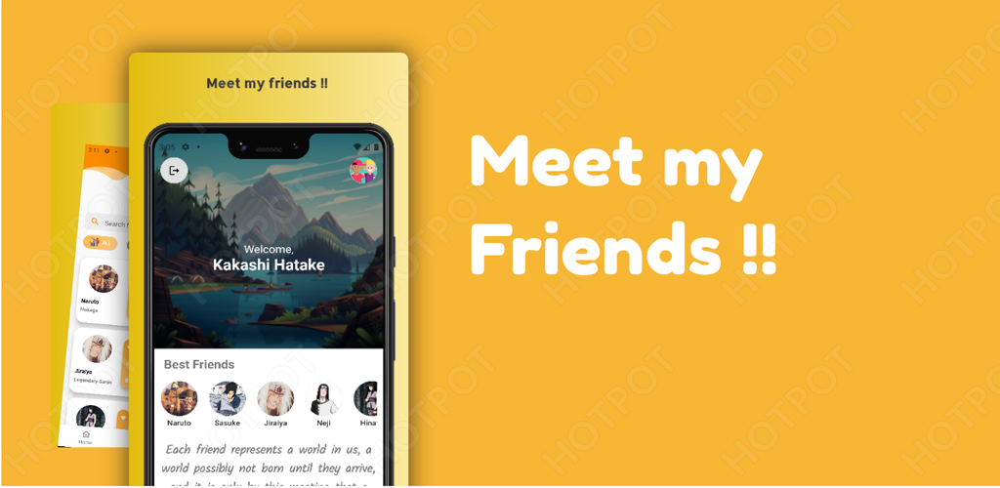
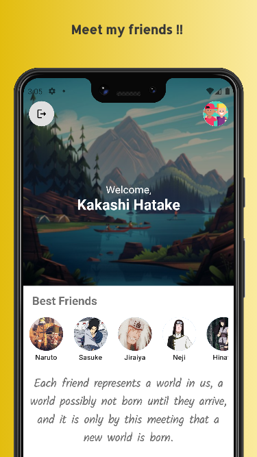
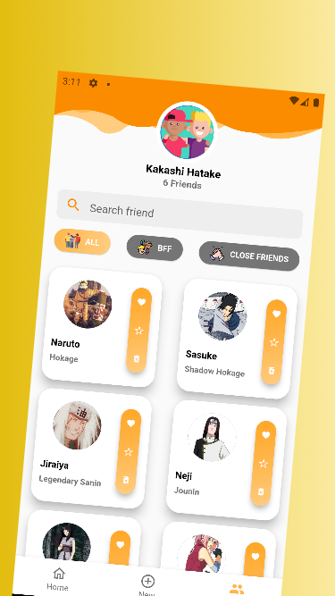
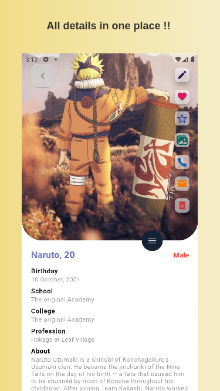
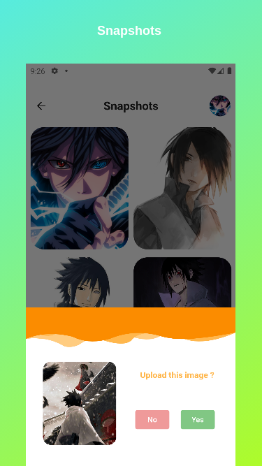
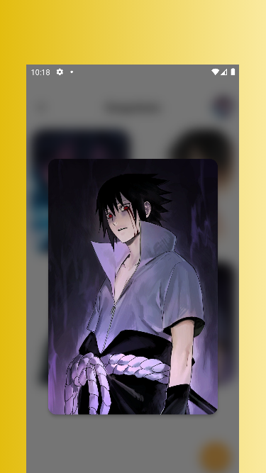

## Meet my friends

Flutter made app dedicated to friends .

## Snaphots

|  ||  ||  ||  || 

## Requirements

* Dart sdk: ">=2.12.0-0 <3.0.0
* [Flutter ">=2.5.3"](https://flutter.dev/docs/get-started/install)
* Android: minSdkVersion 17 and add support for androidx (see AndroidX Migration to migrate an existing app)

# Get Started

* Fork the the project
* Clone the repository to your local machine 
* Checkout the master branch 
* run command - 'flutter run'

## Running the project with Firebase

- Create a new project with the Firebase console.
- Add iOS and Android apps in the Firebase project settings.
- On Android, use `com.Alpha.Friends_App` as the package name.
- then, [download and copy](https://firebase.google.com/docs/flutter/setup#configure_an_android_app) `google-services.json` into `android/app`.
- On iOS, use `com.codingwithflutter.firebaseAuthDemo` as the bundle ID.
- then, [download and copy](https://firebase.google.com/docs/flutter/setup#configure_an_ios_app) `GoogleService-Info.plist` into `iOS/Runner`, and add it to the Runner target in Xcode.

See this document for full instructions:

- [https://firebase.google.com/docs/flutter/setup](https://firebase.google.com/docs/flutter/setup) 

## Setting up Firebase for backend services (Authentication , database and storage )

- Go to Firebase authentication section and enable Email/Password method for authentication
- Go to Firebase Realtime database and create a new database in test mode . Copy the API url and paste it into `lib/Helpers/constants.dart` . 
- Go to Firebase Firestore database and create a new database in test mode.
- Go to Firebase Firestore Storage and create a new database in test mode.

## TODO : Refer to Issues sections

# Developed by

Subhojeet Sahoo

# Get in touch

* [Instagram](https://www.instagram.com/alpha__77__/)
* [Twitter](https://twitter.com/subhojeet_sahoo)

## Contribute

1. Check out the issues .
2. Comment 'want to work on this' to work on the particular issue and wait for the admin to assign you with the task.
3. Make required changes and commit (git commit -m 'Added some feature or fixed this issue').
4. Create new Pull Request

## Happy Fluttering 

